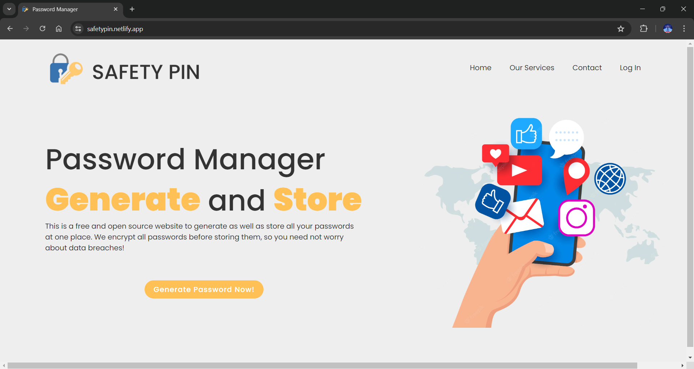

# SafetyPin

 <!-- Add a logo if you have one -->

## Overview

SafetyPin is a secure password manager web application built with Django. It uses AES-256 encryption to ensure the highest level of security for user passwords. SafetyPin also encodes the encryption cipher into an image for additional security.

## Features

- **Secure Password Storage**: Store passwords securely using AES-256 encryption.
- **Encryption Cipher Image Encoding**: Additional security layer by encoding the encryption cipher into an image.
- **User-Friendly Interface**: Easy-to-use interface for managing passwords.
- **Responsive Design**: Access your passwords from any device.

## Tech Stack

- **Frontend**: HTML, CSS, JavaScript
- **Backend**: Django
- **Database**: SQLite (default, can be changed to other databases)
- **Encryption**: AES-256

## Installation

1. **Clone the repository**
   ```sh
   git clone https://github.com/mushtaq2314/SafetyPin.git
   cd SafetyPin
